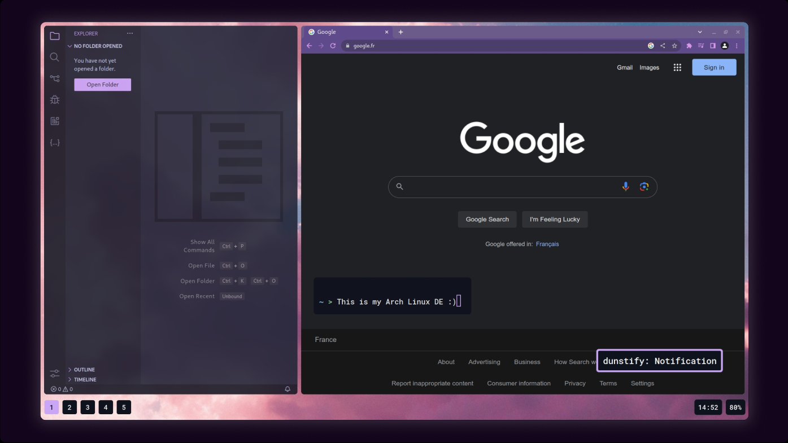

# Preview



# Table of contents

- [Install the config](#install-the-config)
- [Dependencies](#dependencies)
- [Neovim](#neovim)
- [Fonts](#fonts)
- [ZSH](#zsh)
- [Screen](#screen)
- [Wallpapers](#wallpapers)
- [VSCode](#VSCode)
- [Basic shortcuts](#basic-shortcuts)
- [Full dependencies](#full-dependencies)
- [Documentation](#documentation)

# Install the config

```bash
git clone https://github.com/souli-a/dotfiles.git
sudo rm -rf dotfiles/.git
cp -R dotfiles/. ~/
```

**NOTE**: Be sure to have `git` and `nano` or any text editor installed.

# Dependencies

To download the needed dependencies, you must uncomment all libraries from the `/etc/pacman.conf` file if you haven't done it yet.

Uncomment every libraries at the bottom of the file:

```bash
sudo nano /etc/pacman.conf
```

This should be looking like this for every libraries:

```conf
[...]
Include = [...]
```

Also, you can uncomment `ParallelDownloads` (in the same `/etc/pacman.conf` file) and put a bigger number if you have a good internet connexion, for example:

```bash
ParallelDownloads = 50
```

Run this to download the dependencies (these one from the official repository):

```bash
sudo pacman -S sof-firmware nano git dunst rofi pamixer slurp \
pipewire pipewire-alsa pipewire-pulse pipewire-jack \
wireplumber zsh alacritty polkit polkit-gnome \
libnotify gnome-themes-extra xdg-desktop-portal \
xdg-desktop-portal-gtk xdg-desktop-portal-hyprland \
hyprland neovim typescript ripgrep fd prettier mdformat \
python python-pip eslint stylua man-db xdg-utils \
feh mpv noto-fonts-extra noto-fonts-emoji hyprpaper \
```

Install `yay` if you haven't done it:

```bash
git clone https://aur.archlinux.org/yay.git
cd yay
makepkg -si
```

Run this to download the dependencies (these ones from the AUR repository):

```bash
yay -S waybar-hyprland-git wlr-randr visual-studio-code-bin
```

# Neovim

For the Neovim configuration you will need to run this, `packer` is the package manager (this is the one I use) for all the plugins we use in Neovim:

```bash
git clone --depth 1 https://github.com/wbthomason/packer.nvim ~/.local/share/nvim/site/pack/packer/start/packer.nvim
```

And then run this for certain needed dependencies:

```bash
python3 -m pip install --user --upgrade pynvim
```

And run this too, to update and install everything in Neovim:

```bash
nvim +"lua require('lazy').sync({wait=true}); vim.cmd('qa!')" &&
nvim -c ":TSUpdate" +qa &&
nvim -c ":MasonUpdate" +qa
```

**NOTE**: Shortcuts for Neovim are present in configuration files, feel free to explore it.

# Fonts

If you want to use the default font for this custom DE, you will need to run this, in order to scan all the fonts directories and inform the system of the `roboto-mono` font folder here `~/.local/share/fonts/roboto-mono/`:

```bash
fc-cache
```

# ZSH

In the `~/.zshrc` file there are 2 things activated:

1. A zsh [theme](https://github.com/romkatv/powerlevel10k).
2. A [history search plugin](https://github.com/zsh-users/zsh-history-substring-search).

If you want to use them, you need to install them by executing this:

```bash
git clone --depth=1 https://github.com/romkatv/powerlevel10k.git ~/.config/zsh/powerlevel10k/
git clone --depth=1 https://github.com/zsh-users/zsh-history-substring-search.git ~/.config/zsh/zsh-history-substring-search/
```

After this, you will run this to use `zsh` as the default shell:

```bash
chsh -s /usr/bin/zsh
```

And to reload the `zsh` configuration from the `~/.zshrc` file, run this:

```zsh
source ~/.zshrc
```

# Screen

My screen name for Wayland is `HDMI-A-2` so I put it in `~/.config/hypr/hyprpaper.conf` and `~/.config/hypr/hyprland.conf`.

If your screen name is different, you need to change it in these two files, `hyprpaper.conf` and `hypr.conf`.

This is the command to know your screen name (be sure to have `wlr-randr` installed):

```bash
wlr-randr | grep "VGA\|HDMI\|DisplayPort\|DVI"
```

# Wallpapers

To change the wallpaper, you just need to change the directory where you store the wallpapers in ` ~/.config/hypr/hyprpaper.conf`:

```bash
nano ~/.config/hypr/hyprpaper.conf
```

```conf
preload = ~/<the-path-of-your-wallpaper>
wallpaper = HDMI-A-2,~/<the-path-of-your-wallpaper>
```

# VSCode

For the VSCode theming and options related to `settings.json`, install [this](https://marketplace.visualstudio.com/items?itemName=antfu.icons-carbon) (icons theme) and [this](https://marketplace.visualstudio.com/items?itemName=Catppuccin.catppuccin-vsc) (color theme).

# Basic shortcuts

- Shutdown the PC: `SUPER + SHIFT + PARENRIGHT`
- Reboot the PC: `SUPER + SHIFT + EQUAL`

- Launch Alacritty (terminal): `SUPER + G`
- Launch Rofi (search apps): `SUPER + A`
- Launch VSCode: `SUPER + E`
- Launch Google Chrome: `SUPER + D`

- Put the window in fullscreen: `SUPER + SHIFT + F`
- Kill the window (close): `SUPER + SPACE`

You can edit and see all the Hyprland shortcuts in the `~/.config/hypr/hyprland.conf` file.

You can also modify you [keyboard layout](https://www.reddit.com/r/hyprland/comments/xtxmv8/eli5_how_do_i_change_keyboard_layout_in_hyprland/) in `hyprland.conf`.

# Full dependencies

**NOTE**: Don't install it if you don't know what you are doing.

This is my full Arch installation dependencies:

```bash
# AUR repository

pnpm anki google-chrome waybar-hyprland-git wlr-randr visual-studio-code-bin
```

```bash
# Official repository

ntfs-3g ffmpeg4.4 dunst rofi mesa lib32-mesa pamixer \
htop slurp qt5-wayland qt6-wayland obsidian otf-opendyslexic-nerd \
pipewire pipewire-alsa pipewire-pulse pipewire-jack \
wireplumber nodejs zsh alacritty polkit polkit-gnome \
libnotify gammastep gnome-themes-extra xdg-desktop-portal \
xdg-desktop-portal-gtk xdg-desktop-portal-hyprland \
hyprland neovim mdformat prettier typescript ripgrep fd eslint stylua \
python python-pip wl-clipboard \
man-db nnn xdg-utils feh yt-dlp mpv gnu-free-fonts \
noto-fonts-extra noto-fonts-emoji thunar hyprpaper tree \
base linux-zen linux-firmware sof-firmware base-devel \
efibootmgr nano intel-ucode git
```

# Documentation

For all the specific options present in each tool configuration, please consult the corresponding documentation.
